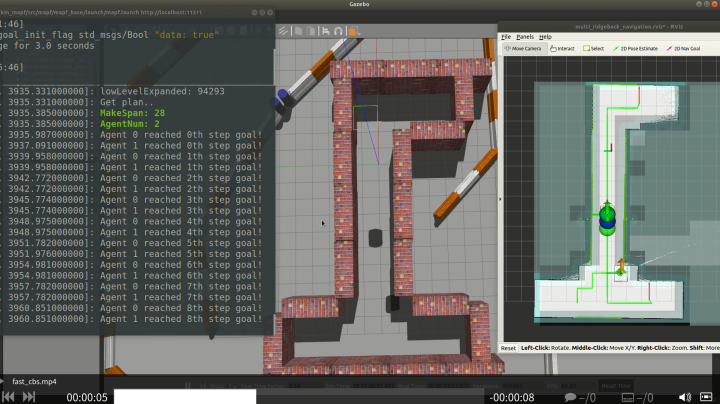
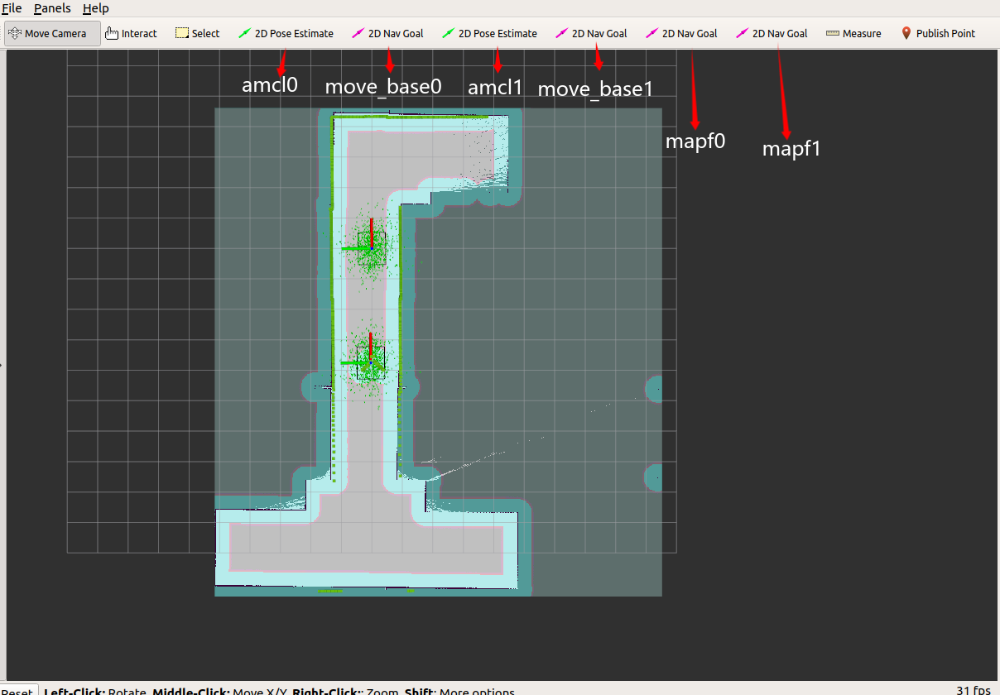
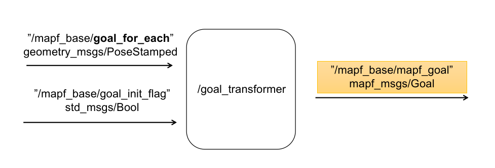
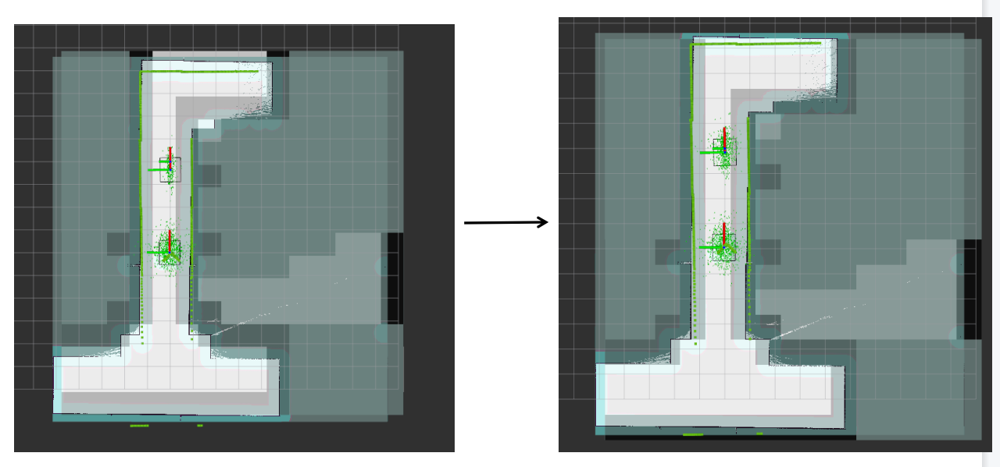

<div align='center'>
  
</div>

<div align='center'>
  English | <a href='./README.zh-CN.md'>中文</a>
</div>

---

This is a test case repository for [mapf_ros](https://github.com/speedzjy/mapf_ros) package.

The robot used for the simulation test is **ridgeback**, which supports **omnidirectional** movement, the official website address is at [https://clearpathrobotics.com/assets/guides/melodic/ridgeback/index.html](https://clearpathrobotics.com/assets/guides/melodic/ridgeback/index.html). The official tutorial introduces the mapping and planning operations of a single robot in detail. After you are familiar with the process, you can clone this repository for multi-robot testing.


# Dependences
This package has only been tested on **Ubuntu 18.04**

- [navigation](https://github.com/ros-planning/navigation)
  - ```sudo apt install ros-melodic-navigation```
- [teb_local_planner](https://github.com/rst-tu-dortmund/teb_local_planner)
  - download code and build: ```catkin_make```
- [ridgeback_simulater](https://github.com/ridgeback/ridgeback_simulator)
  - ```sudo apt install ros-melodic-ridgeback-simulator```

# Build
```
catkin_make
```

# Run

## quick start
- bringup
```
roslaunch ridgeback_test multi_ridgeback_world.launch
```
- amcl and move_base node
```
roslaunch ridgeback_navigation multi_nav.launch
```
- mapf
```
roslaunch mapf_base mapf_example.launch
```

<div align='center'>
  
</div>

As shown in the figure, the first four buttons in rviz are traditional navigation buttons, which are used to control the positioning and movement of the two robots, and the last two buttons are used to send mapf targets to the mapf_base node.

<div align='center'>
  
</div>

After sending the mapf target point using the last two buttons, run:
```
rostopic pub --once /mapf_base/goal_init_flag std_msgs/Bool "data: true"
```
Then the mapf_base node will generate a global plan, which can be visualized in rviz.

## mapping

Use a single robot to build a map.　

The steps are roughly the same as the official tutorial.

- bringup
```
roslaunch ridgeback_test ridgeback_world.launch
```
- mapping
  - dependences: [slam_karto](https://github.com/ros-perception/slam_karto), [open_karto](https://github.com/ros-perception/open_karto)
```
roslaunch ridgeback_navigation karto_demo.launch
``` 
You can also use gmapping, remember to open two gmapping nodes, refer to the configuration of [karto_demo.launch](https://github.com/speedzjy/ridgeback_mapf/blob/main/ridgeback_navigation/launch/karto_demo.launch).

**Notes:** The mapping process produces both low-resolution and high-resolution maps

- save:
  - high-resolution map: ```rosrun map_server map_saver map:=/map -f ./mymap```
  - low-resolution map: ```rosrun map_server map_saver map:=/map_low_resolution -f ./mymap_low_reso```

**Notes:**
If the low-resolution map and the high-resolution map do not completely overlap, the **origin** param in the **mymap_low_reso.yaml** file needs to be modified appropriately to make the two maps appear to overlap.

<div align='center'>
  
</div>

## Run mapf with new map
- change the **high**-resolution map name in [multi_nav_single.launch](https://github.com/speedzjy/ridgeback_mapf/blob/main/ridgeback_navigation/multi_launch/multi_nav_single.launch)
- change the **low**-resolution map name in [mapf_example.launch](https://github.com/speedzjy/mapf_ros/blob/main/mapf_base/launch/mapf_example.launch)

Then follow the quickstart steps.