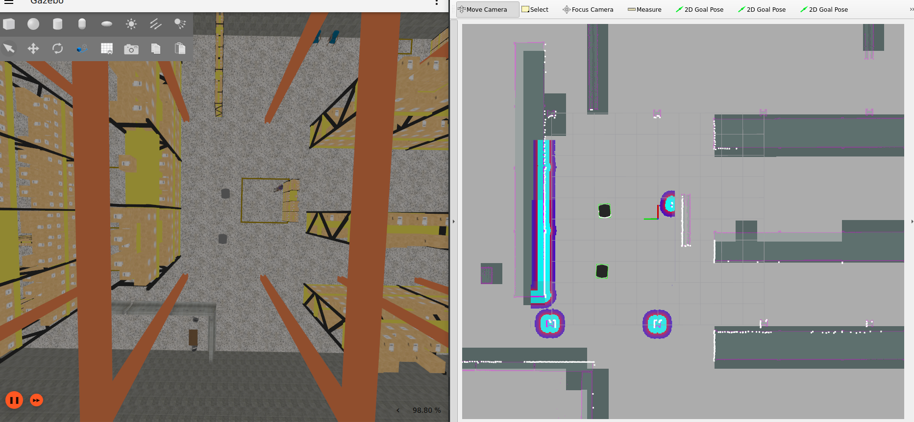
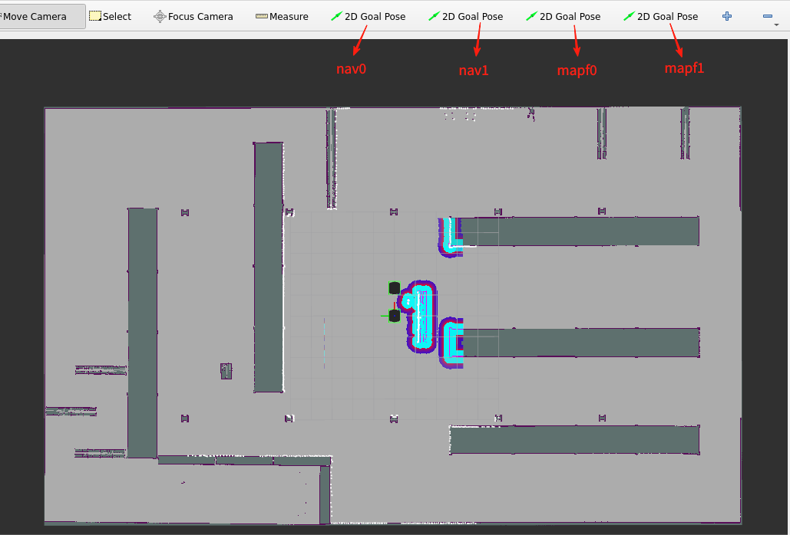
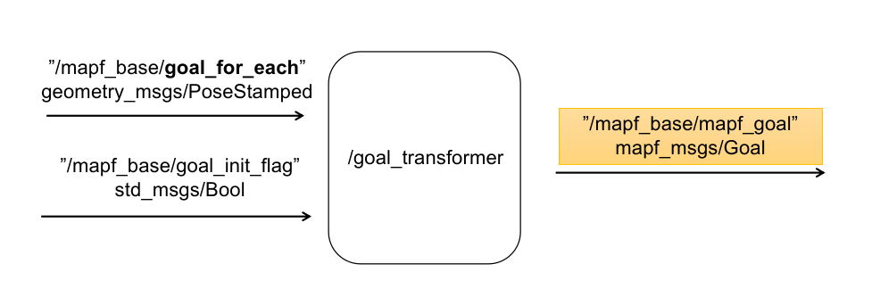

<div align='center'>
  
</div>

<div align='center'>
  English | <a href='./README.zh_CN.md'>中文</a>
</div>

---

This is a test case repository for [mapf_ros](https://github.com/speedzjy/mapf_ros) package.

The robot used for the simulation test is **ridgeback**, which supports **omnidirectional** movement, the official website address is at [clearpath](https://docs.clearpathrobotics.com/docs/ros/). The official tutorial introduces the mapping and planning operations of a single robot in detail. After you are familiar with the process, you can clone this repository for multi-robot testing.


# Dependences
This package has only been tested on **ROS humble** in **Ubuntu 22.04**

[nav2](https://github.com/ros-navigation/navigation2) | [clearpath](https://github.com/clearpathrobotics) | cartographer

```
sudo apt update
sudo apt install ros-humble-navigation2 ros-humble-clearpath-simulator
sudo apt install ros-humble-cartographer ros-humble-cartographer-ros
```

# Build
```
mkdir -p ros2_ws/src && cd ros2_ws/src
git clone --recurse-submodules -b humble https://github.com/speedzjy/ridgeback_mapf.git 
cd ..
colcon build --symlink-install
```

# Run

## quick start

- robot yaml prepare

Create a clearpath folder in the home directory (~) along with subfolders for each robot. Place the following robot configuration file named robot.yaml in each subfolder. Note that the `ros2:namespace `field in the configuration file must follow the format rb_ followed by a number (e.g., rb_0, rb_1).

```
serial_number: r100-0000
version: 0
system:
  hosts:
    - hostname: cpr-r100-0000
      ip: 192.168.131.1
  ros2:
    namespace: rb_0
sensors:
  lidar2d:
    - model: sick_lms1xx
      parent: chassis_link
      xyz: [0.3455, 0.0, 0.1977]
    - model: sick_lms1xx
      parent: chassis_link
      xyz: [-0.3455, 0.0, 0.1977]
      rpy: [0.0, 0.0, 3.14159]

```

Directory structure is as follows:
```
$ tree -L 3
.
|-- clearpath
|   |-- rb_0
|   |   `-- robot.yaml
|   |-- rb_1
|   |   `-- robot.yaml
```


- bringup
```
ros2 launch multi_ridgeback_sim multi_rb_bringup.launch.py
```
- localization and navigation
```
ros2 launch multi_ridgeback_sim multi_localization.launch.py
```
- mapf
```
ros2 launch mapf_base mapf_example.launch.py
```

<div align='center'>
  
</div>

As shown in the figure, the first two buttons in rviz are traditional navigation buttons, which are used to control the positioning and movement of the two robots, and the last two buttons are used to send mapf targets to the mapf_base node.

<div align='center'>
  
</div>

After sending the mapf target point using the last two buttons, run:
```
ros2 topic pub --once /mapf/goal_init_flag std_msgs/msg/Bool "{data: true}"
```
Then the mapf_base node will generate a global plan, which can be visualized in rviz.

## mapping

Use a single robot to build a map.　

Edit file [multi_rb_bringup.launch.py](https://github.com/speedzjy/ridgeback_mapf/blob/humble/multi_ridgeback_sim/launch/bringup/multi_rb_bringup.launch.py)

Comment out all lines in `ROBOT_LIST` except for `rb_0`


- bringup
```
ros2 launch multi_ridgeback_sim multi_rb_bringup.launch.py
```
- mapping
```
ros2 launch multi_ridgeback_sim cartographer.launch.py
``` 

Save the map:
```
ros2 service call /rb_0/finish_trajectory cartographer_ros_msgs/srv/FinishTrajectory "{trajectory_id: 0}"
ros2 run nav2_map_server map_saver_cli -t /rb_0/map -f mymap
```


**Notes:**

After building the map, convert the high-resolution map into a low-resolution map.

```
sudo apt install imagemagick
----------------------------
convert input.pgm -resize 50% output_low_resolution.pgm
```

If the low-resolution map and the high-resolution map do not completely overlap, the **origin** param in the **mymap_low_reso.yaml** file needs to be modified appropriately to make the two maps appear to overlap.

## Run mapf with new map
- change the **high**-resolution map name in [localization.launch.py](https://github.com/speedzjy/ridgeback_mapf/blob/humble/multi_ridgeback_sim/launch/localization/localization.launch.py)
- change the **low**-resolution map name in [mapf_example.launch.py](https://github.com/speedzjy/mapf_ros/blob/humble/mapf_base/launch/mapf_example.launch.py)

Then follow the quickstart steps.