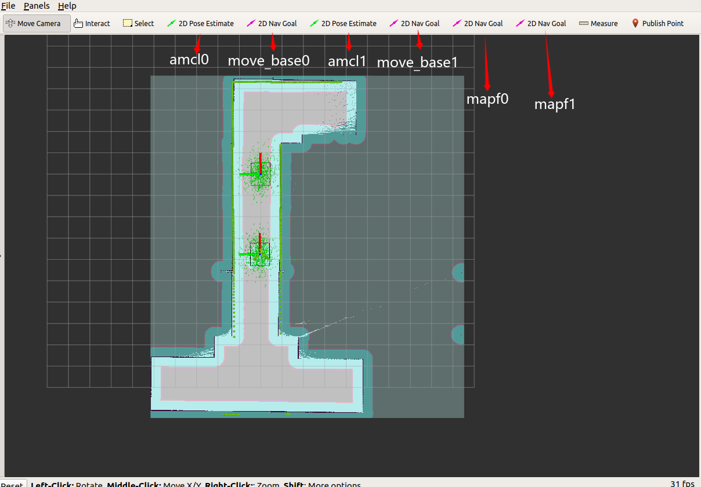
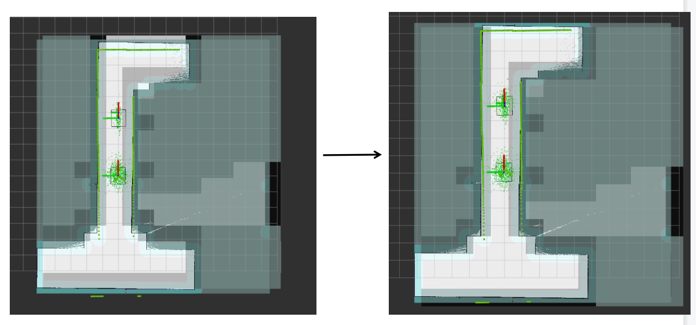

<div align='center'>
  
</div>

<div align='center'>
  <a href='./README.md'>English</a> | 中文
</div>

---

本仓库作为测试用例仓库供 [mapf_ros](https://github.com/speedzjy/mapf_ros) 使用.

仿真用的机器人是 ridgeback, 支持全向移动,官方网站[https://clearpathrobotics.com/assets/guides/melodic/ridgeback/index.html](https://clearpathrobotics.com/assets/guides/melodic/ridgeback/index.html). 官方教程详细介绍了单机器人的建图和导航步骤．建议进行接下来的实验之前先熟悉流程．


# 依赖
实验测试的平台为 **Ubuntu 18.04**

- [navigation](https://github.com/ros-planning/navigation)
  - ```sudo apt install ros-melodic-navigation```
- [teb_local_planner](https://github.com/rst-tu-dortmund/teb_local_planner)
  - download code and build: ```catkin_make```
- [ridgeback_simulater](https://github.com/ridgeback/ridgeback_simulator)
  - ```sudo apt install ros-melodic-ridgeback-simulator```

# 编译
```
catkin_make
```

# Run

## quick start
- bringup
```
roslaunch ridgeback_test multi_ridgeback_world.launch
```
- amcl and move_base node
```
roslaunch ridgeback_navigation multi_nav.launch
```
- mapf
```
roslaunch mapf_base mapf_example.launch
```

<div align='center'>
  
</div>

如图所示，rviz 中前四个按钮用于两台机器人的 amcl 定位和 move_base 导航，最后两个按键用于向 mapf 节点发送两台机器人的目标点.

<div align='center'>
  
</div>

向 mapf 节点发送两台机器人的目标点后，用 rostopic 发送确认命令:
```
rostopic pub --once /mapf_base/goal_init_flag std_msgs/Bool "data: true"
```
之后，mapf_base 节点将生成全局路径，可以在 rviz 中可视化看到

## 建图

使用单机器人进行建图，步骤大体和官方教程一致．

- bringup
```
roslaunch ridgeback_test ridgeback_world.launch
```
- mapping
  - dependences: [slam_karto](https://github.com/ros-perception/slam_karto), [open_karto](https://github.com/ros-perception/open_karto)
```
roslaunch ridgeback_navigation karto_demo.launch
``` 
也可以用 gmapping, 记得开两个 gmapping节点，参考 [karto_demo.launch](https://github.com/speedzjy/ridgeback_mapf/blob/main/ridgeback_navigation/launch/karto_demo.launch) 的配置.

**Notes:** 建图过程将同时生成高分辨率和低分辨率的地图，都需要进行保存

- save:
  - high-resolution map: ```rosrun map_server map_saver map:=/map -f ./mymap```
  - low-resolution map: ```rosrun map_server map_saver map:=/map_low_resolution -f ./mymap_low_reso```

**Notes:**
如果在建图过程中，低分辨率地图和高分辨率地图没有完全重叠，可以在低分辨率的地图 yaml 文件中对 origin 参数进行修改，使得高分辨率和低分辨率地图看起来重合较好

<div align='center'>
  
</div>

## Run mapf with new map
- 修改 [multi_nav_single.launch](https://github.com/speedzjy/ridgeback_mapf/blob/main/ridgeback_navigation/multi_launch/multi_nav_single.launch) 文件中高分辨率地图名称
- 修改 [mapf_example.launch](https://github.com/speedzjy/mapf_ros/blob/main/mapf_base/launch/mapf_example.launch) 文件中低分辨率地图名称

之后按照 quickstart 步骤进行．